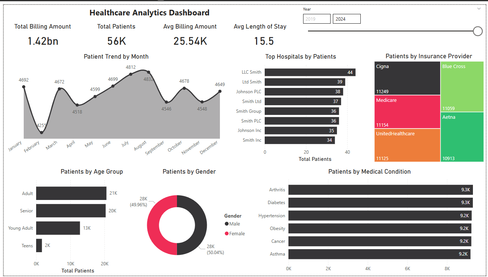

# Healthcare-Analytics-Dashboard
interactive Healthcare Analytics Dashboard built using Power BI.

This project is an interactive Healthcare Analytics Dashboard built using Power BI. It analyzes patient data, billing information, and hospital performance to provide meaningful insights for better decision-making.

Key Features
Patient trend analysis by month
Patient distribution by age group and gender
Analysis of medical conditions
Insurance provider comparison
Top hospitals by number of patient
Key KPIs
Total Patients: 56K
Total Billing Amount: 1.42bn
Average Billing Amount: 25.54K
Average Length of Stay: 15.5
🛠 Tools & Technologies

Power BI
SQL
Microsoft Excel
Data Cleaning & Transformation

🎯 Business Insights
Majority of patients fall under Adult age group
Billing is influenced by insurance providers
Certain medical conditions have higher patient counts
Patient trends vary across months
🚀 Conclusion

This dashboard helps in understanding patient behavior, hospital performance, and financial metrics, enabling data-driven decision-making in the healthcare domain.

Dashboard Preview

